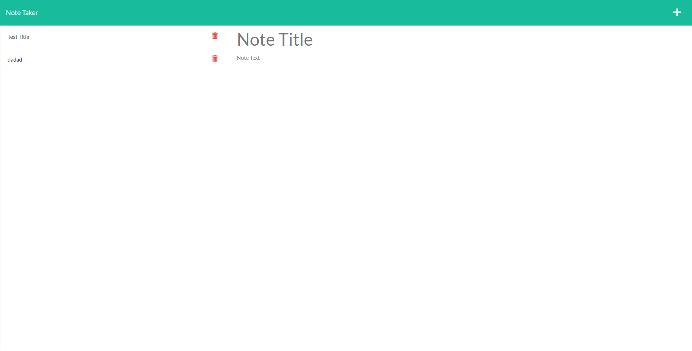

# note-taker

## Description
This application was built using HTML, CSS, and Javascript for the frontend, with Node.js and Express.js for the backend. It is designed to take notes.

## Table of Contents
 - [Installation](#installation)
 - [Usage](#usage)
 - [License](#license)
 - [Contributing](#contributing)
 - [Tests](#tests)
 - [Questions](#Questions)

## Installation
No installation is required.

## Usage
Write notes in the space provided. Hit the save button to save the note, and the "plus" button to write a new note. 

## License
[https://opensource.org/licenses/MIT](https://opensource.org/licenses/MIT)

Permission is hereby granted, free of charge, to any person obtaining a copy of this software and associated documentation files (the "Software"), to deal in the Software without restriction, including without limitation the rights to use, copy, modify, merge, publish, distribute, sublicense, and/or sell copies of the Software, and to permit persons to whom the Software is furnished to do so, subject to the following conditions:

The above copyright notice and this permission notice shall be included in all copies or substantial portions of the Software.
    
THE SOFTWARE IS PROVIDED "AS IS", WITHOUT WARRANTY OF ANY KIND, EXPRESS OR IMPLIED, INCLUDING BUT NOT LIMITED TO THE WARRANTIES OF MERCHANTABILITY, FITNESS FOR A PARTICULAR PURPOSE AND NONINFRINGEMENT. IN NO EVENT SHALL THE AUTHORS OR COPYRIGHT HOLDERS BE LIABLE FOR ANY CLAIM, DAMAGES OR OTHER LIABILITY, WHETHER IN AN ACTION OF CONTRACT, TORT OR OTHERWISE, ARISING FROM, OUT OF OR IN CONNECTION WITH THE SOFTWARE OR THE USE OR OTHER DEALINGS IN THE SOFTWARE.

## Contributing
Please contact through the email below if you wish to contribute.
## Tests
No testing was used for this application.
## Questions
 * For any further questions, you may reach out by emailing [hogan.r.sherrow@vanderbilt.edu](hogan.r.sherrow@vanderbilt.edu).
 * [@hoganrsherrow](www.https://github.com/hoganrsherrow)

 Link to the deployed [application](https://young-falls-06469.herokuapp.com).

 Link to the [repository](https://github.com/hoganrsherrow/note-taker).

 

 